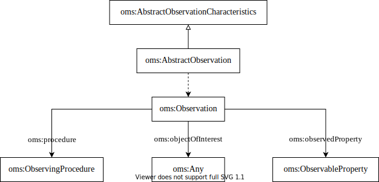

# I-ADOPT to Ecological Metadata Language (EML)

Ecological Metadata Language (EML) [OMS-docs] is the latest revision of 

Whenever possible, EML adopted entire trees of information in order to facilitate conversion of EML documents into other metadata languages. EML was designed with the following standards in mind: Dublin Core Metadata Initiative, the Content Standard for Digital Geospatial Metadata (CSDGM from the Federal Geographic Data Committee (FGDC)), the Biological Profile of the CSDGM (from the National Biological Information Infrastructure), the International Standards Organization’s Geographic Information Standard (ISO 19115), the ISO 8601 Date and Time Standard, the OpenGIS Consortiums’s Geography Markup Language (GML), the Scientific, Technical, and Medical Markup Language (STMML), and the Extensible Scientific Interchange Language (XSIL).

| EML                    | I-ADOPT                                               |
|------------------------|-------------------------------------------------------|
| eml:ObservableProperty | iop:Variable                                          |
| eml:FeatureOfInterest  | iop:Entity + iop:hasObjectOfInterest                  |
| ?oms:constraints on the ObservingProcedure or ?oms:AbstractObservationCharacteristics | iop:Constraint                                          |

## References

* [OMS] Katharina Schleidt, Ilkka Rinne, Sylvain Grellet (2021) OGC Abstract Specification. Geographic Information - Observations, Measurements and Samples; OGC 20-082r2 and ISO 19156:2020. https://github.com/opengeospatial/om-swg/tree/master/oms-abstract-spec/ogc-as-topic20
* [OMS-docs] http://iso.sparxcloud.com/login.php
